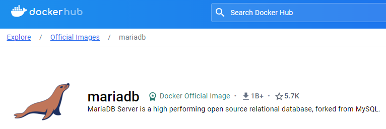

Creation of the Docker image using the Compose file - SpringBoot, Connection to MySql Database
=============
---

[`SPRINGBOOT`]    [`DOCKER`]  

[`MARIADB-MYSQL-PHPMYADMIN`] 


- Minimal [Spring Boot v.3](http://projects.spring.io/spring-boot/)    sample app
- [JDK 17](https://www.oracle.com/java/technologies/downloads/#java17)
- [Maven 3.9.6](https://maven.apache.org)

- [Windows (WSL 2) Subsystem for Linux Documentation](https://learn.microsoft.com/en-us/windows/wsl/)
    * 

- [Docker Desktop for Windows](https://docs.docker.com/desktop/install/windows-install/) after download and created account on Docker, it's necessary bind to subsystem WSL Windows.
    * 

- https://hub.docker.com/_/mariadb 
    * 


### Commands
[Base Command Docker](https://docs.docker.com/reference/cli/docker/)

--- 

## IMAGE AND CONTAINER CREATION


#### **Step by step**
1. Create your project with [**Spring Initailizr**](https://start.spring.io/)  
  and create jar with [`mvn clean install`].

2. Create your Docker File named [`Dockerfile`] without extension at project level folder

    ```
     FROM openjdk:17-alpine
     EXPOSE 8181
     ADD target/*.jar springboot-app.jar
     ENTRYPOINT ["java","-jar","/springboot-app.jar"]
    ```
    Manual Docker : https://docs.docker.com/reference/dockerfile/ 
     - FROM — We need the JDK for the Spring application to run.
     - EXPOSE — tells which port it will run on.
     - ADD — the resulting jar is copied to the file named "springboot-app.jar".
     - ENTRYPOINT — set image main command - runs the previously copied jar file.

3. Create compose file with yaml extension [`docker-compose.yaml`].
  After defining the compose file, IntelliJ helps you execute it so as to create the Images: 
  [`SpringBoot App`, `MariaDB Server`, `PhpMyAdmin Client`]. A Container will be created and run, 
  with these images inside.
     
    

   - On IntelliJ IDEA you can see the results of the execution
     

   - Also in Docker Desktop Client you can see the result:
      

   * PhpMyAdmin Client is up on localhost at port 8080 :
  
     

       - Server `db` created.
       - Database `demo_db` created.
       - Current User default `root`.
         

    * SpringBoot App is now running locally.
     

    - Locally go to url http://localhost:8181/api/ip. 
      This endpoint adds the info as a new row in the database.
      ```
      {
        "msg": "Localhost Info!!",
        "ip": "177.10.0.2",
        "hostname": "a6e865e1oeba"
      }
      ``` 

   * MariaDB Server is running on port 3306 
     