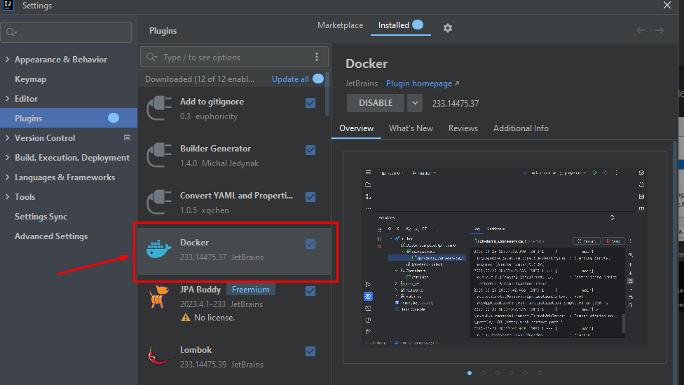

[`SPRINGBOOT`]    [`DOCKER`]   [`MARIADB-MYSQL-PHPMYADMIN`] 


---
Spring Boot App Mysql Database Connection - Docker Image Creation Orchestrated through Compose file
=============

# Required Setup

- [**Spring Boot v.3**](http://projects.spring.io/spring-boot/)   or above
- [**Install Java**](https://docs.aws.amazon.com/corretto/latest/corretto-17-ug/windows-install.html) locally and set environment variable system.
    - [Download JDK 17 ORACLE](https://www.oracle.com/java/technologies/downloads/#java17)
    - [Download JDK 17 AMAZON CORRETTO](https://github.com/corretto/corretto-17/releases)
- [**Maven 3.9.6**](https://maven.apache.org)
    1. **Installing Maven on Windows**:
        1. The environment variable for JAVA also needs to be set beforehand
        2. [**Download Maven zip**](https://maven.apache.org/download.cgi) **apache-maven-3.9.6-bin.zip** on your Computer locally.
        3. Unzip or Extract folder and put on at C disk level.
        4. Create the MAVEN_HOME system environment variable that points to the **_C:\apache-maven-3.9.6_** folder path.
           
       5. Verify the correct MAVEN installation by command [`mvn -v`] 

- [Install Plugin Docker on IntelliJ IDEA](https://plugins.jetbrains.com/plugin/7724-docker)
    * 

- [Windows (WSL 2) Subsystem for Linux Documentation](https://learn.microsoft.com/en-us/windows/wsl/)
    * 

- [Docker Desktop for Windows](https://docs.docker.com/desktop/install/windows-install/) after download and created account on Docker, it's necessary bind to subsystem WSL Windows.
    * 

----

## IMAGE AND CONTAINER CREATION


### **Step by step**

##### [Docker - Base Commands](https://docs.docker.com/reference/cli/docker/)

1. Create  project with [**Spring Initailizr**](https://start.spring.io/)   and built project and create jar with [`mvn clean install`].

2. Create **Docker File** named [`Dockerfile`] without extension at project level folder 
   * 
    
   *  Inside this file insert this simple configuration to create the image of our App.

       ```
        FROM openjdk:17-alpine
        EXPOSE 8181
        ADD target/*.jar springboot-app.jar
        ENTRYPOINT ["java","-jar","/springboot-app.jar"]
       ```
   * [Dockerfile reference](https://docs.docker.com/reference/dockerfile/)
     - FROM — We need the JDK for the Spring application to run.
     - EXPOSE — tells which port it will run on.
     - ADD — the resulting jar is copied to the file named "springboot-app.jar".
     - ENTRYPOINT — set image main command - runs the previously copied jar file.


3. Create **compose file** with yaml extension [`docker-compose.yaml`].
   IntelliJ helps you run and create images through Docker Plugin:
    - [`SpringBoot App`, `MariaDB Server`, `PhpMyAdmin Client`]. 
    - A Container will be created and run it with these images.
    - The Spring Boot App will be orchestrated by Dockerfile.
     
      

     - After executed the **Compose File** by Plugin on IntelliJ IDEA you can see the results of the execution :
       

     - On Docker Desktop Client you can see the result:
        

       1. PhpMyAdmin Client is up on localhost at port 8080 :
         
           - Server `db` created.
           - Database `demo_db` created.
           - Current User default `root`.
             

       2. SpringBoot App is now running locally.
          
           - Locally go to url http://localhost:8181/api/ip. 
             This endpoint adds the info as a new row in the database.
            
            ```
              {
                "msg": "Localhost Info!!",
                "ip": "177.10.0.2",
                "hostname": "a6e865e1oeba"
              }
            ```
         
       3. MariaDB Server is running on port 3306 
        
          

           * As a result 3 images were created:
               1. [x] Spring Boot App (Inside of Container)
               2. [x] MariaDB Server (Database Mysql)
               3. [x] PhpMyAdmin Client
           - and one Container
               1. [x] container_docker_compose_example


****
In summary:
>  We have seen the creation of a Docker image from Spring Boot app that connects to a Mysql Database and its Client
orchestrated by Composer file and Dockerfile from Plugin Docker on IntelliJ IDE.


That's all!!...
*** 
