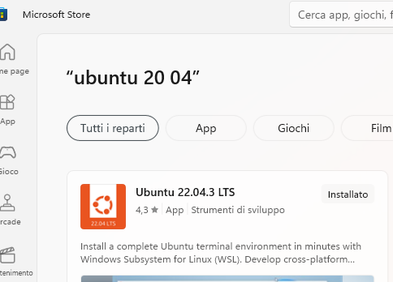

 


[`SPRINGBOOT`]    [`DOCKER`] 

---
Spring Boot OCI Image by Docker Engine - Simple Example
=============

# Required Setup

- [**Spring Boot v.3**](http://projects.spring.io/spring-boot/)   or above
- [**Install Java**](https://docs.aws.amazon.com/corretto/latest/corretto-17-ug/windows-install.html) locally and set environment variable system.
    - [Download JDK 17 ORACLE](https://www.oracle.com/java/technologies/downloads/#java17)
    - [Download JDK 17 AMAZON CORRETTO](https://github.com/corretto/corretto-17/releases) 
- [**Maven 3.9.6**](https://maven.apache.org)
    1. **Installing Maven on Windows**:
        1. The environment variable for JAVA also needs to be set beforehand
        2. [**Download Maven zip**](https://maven.apache.org/download.cgi) **apache-maven-3.9.6-bin.zip** on your Computer locally.
        3. Unzip or Extract folder and put on at C disk level.
        4. Create the MAVEN_HOME system environment variable that points to the **_C:\apache-maven-3.9.6_** folder path.
           
        5. Verify the correct MAVEN installation by command [`mvn -v`] 

- [Install Plugin Docker on IntelliJ IDEA](https://plugins.jetbrains.com/plugin/7724-docker)
    * 

- [Windows (WSL 2) Subsystem for Linux Documentation](https://learn.microsoft.com/en-us/windows/wsl/)
    * 

- [Docker Desktop for Windows](https://docs.docker.com/desktop/install/windows-install/) after download and created account on Docker, it's necessary bind to subsystem WSL Windows.
    * 

----

# [**Open Container Initiative (OCI)**](https://opencontainers.org/)
  - An example of its use is the compatibility by Docker or Podman (two container orchestration tools). 
[**Podman vs Docker**](https://www.imaginarycloud.com/blog/podman-vs-docker/#Docker)

* [**OCI Image Specification**](https://www.javelynn.com/cloud/what-is-an-oci-compliant-container-image/)
  OCI is a specification led by the Linux Foundation's Opencontainers initiative. 
  This specification defines what the execution environment of a container (Runtime) 
  should be and also the packaging format of the images that will run in that execution environment.
  The benefits of **OCI-compliant container images** are numerous. Perhaps the most significant benefit 
  is that they can be used across different platforms and environments. 
  This is because they adhere to a set of standards that are recognized by the industry.
  ( [**OCI Spec Github**](https://github.com/opencontainers/image-spec) )

  1. **Use Cases for OCI-Compliant Container Images**
     * **Cloud-native applications:** OCI-compliant container images are well-suited for cloud-native applications as they can be easily deployed and managed in cloud environments.
     * **Microservices** Microservices are a good fit for OCI-compliant container images as they can be easily containerized and deployed in a consistent and interoperable way.
     * **Continuous Integration and Deployment**: CI/CD pipelines benefit from the ability to use consistent and verifiable container images.
     * **Hybrid and Multi-cloud environments**: OCI-compliant container images can be used across different platforms and environments, making them ideal for hybrid and multi-cloud environments.
     * Some **other popular use cases** include:
       1. Container orchestration and management
       2. DevOps and automation
       3. IoT and Edge computing
       4. Big data and analytics
    
  2. **Challenges and Limitations OCI-Compliant Container Image**
     Some challenges and limitations of OCI (Open Container Initiative) compliant container images include:
     * **File size limitations**: OCI images are limited in size, which can make it difficult to package larger applications or dependencies.
     * **Compatibility issues**: Not all container orchestration platforms fully support OCI images, which can lead to compatibility issues. 
     * **Complex image creation process**: Creating OCI compliant images can be complex, as it requires understanding and following a specific set of guidelines and best practices.
     * **Limited support for legacy applications** : OCI images may not be suitable for legacy applications that have not been designed to run in containers.
     * **Security concerns**: As with any containerized application, OCI images may have security vulnerabilities that need to be identified and addressed.
     * **Limited support for non-linux systems**: OCI images are mainly supported by linux-based systems, so it is not easily portable to non-linux systems.
     * **Limited support for non-containerized systems**: OCI images are only compatible with container orchestration systems and not directly with non-containerized systems.


* [**Spring Boot Maven and Gradle Plugins**](https://spring.io/guides/topicals/spring-boot-docker)
  - You can use the Spring Boot build plugins for Maven and Gradle to create container images. The plugins create an OCI image 
  (the same format as one created by docker build) by using [**Cloud Native Buildpacks**](https://github.com/buildpacks/spec/blob/main/README.md). You do not need a Dockerfile, but you do need a Docker daemon, either locally (which is what you use when you build with docker) or remotely through 
  the DOCKER_HOST environment variable.

# [**Buildpacks**](https://buildpacks.io/docs/for-app-developers/concepts/buildpack/)

- Allow application developers to focus on what they do best - writing code, without having to worry about image security, optimizing container images, or container build strategy.
  `'Avoid developer confusion in Dockerfile definition by leaving this work to Buildpacks'`
  > Transform your application source code into images that can run on any cloud.
    **Buildpacks** examine your app source code, identify and gather dependencies, and output OCI compliant app
    and dependency layers.

  - [**Paketo-Buildpacks(jammy-base-stack) Github**](https://github.com/paketo-buildpacks)
  - Buildpacks transform your application source code into container images **without using Dockerfiles**
  - The Paketo open source project provides production-ready buildpacks for the most popular languages and frameworks
  - Use Paketo Buildpacks to easily build your apps and keep them updated
  - [**How to Use - Video Demo**](https://www.youtube.com/watch?v=d_L_AZyocWA&ab_channel=CloudNativeBuildpacks)
  - [**Java Buildpack Reference**](https://paketo.io/docs/reference/java-reference/)
     >  * paketobuildpacks/builder-jammy-base:latest is specific Paketo Builder
     >  * The Paketo Buildpack for Java is a **Cloud Native Buildpack** with an order definition suitable for Java applications.

   - [**Other Builders**](https://paketo.io/docs/reference/builders-reference/)
  - ##### **IMPORTANT TO READ** 
    - [**How to Build Java Apps with Paketo Buildpacks**](https://paketo.io/docs/howto/java/)
    - [**Blog about Buildpacks Springboot**](https://www.codecentric.de/wissens-hub/blog/buildpacks-spring-boot)
--- 

### Step by step

1. Create your project with [**Spring Initailizr**](https://start.spring.io/)  
   2. After implementing app, proceed to create the OCI format image
         #### Create JAR and OCI IMAGE FORMAT
         * After finish to implements your App SpringBoot it's necessary to build and create **\*.jar** and **OCI IMAGE** by Maven command [`mvn spring-boot:build-image`]. Building our App will also create the OCI Image together 
      >    After executing the command, the specific Builder is downloaded, in our case 
         [**Paketo Jammy Base Builder Github**](https://github.com/paketo-buildpacks/builder-jammy-base)
         This builder uses the Paketo Jammy Base Stack (Ubuntu Jammy Jellyfish build and run images) with 
         buildpacks for Java, Java Native Image, Go, Python, .NET, Node.js, Apache HTTPD, NGINX and Procfile.
   
      **OUTPUT**
      ```
          "C:\Program Files\Java\jdk-17\bin\java.exe" -Dmaven.multiModuleProjectDirectory=C:\Users\marcc\develop\wrspace\docker\springboot-docker-examples\docker-engine-oci-image-simple-example -Djansi.passthrough=true -Dmaven.home=C:\Users\marcc\.m2\wrapper\dists\apache-maven-3.9.6-bin\439sdfsg2nbdob9ciift5h5nse\apache-maven-3.9.6 -Dclassworlds.conf=C:\Users\marcc\.m2\wrapper\dists\apache-maven-3.9.6-bin\439sdfsg2nbdob9ciift5h5nse\apache-maven-3.9.6\bin\m2.conf "-Dmaven.ext.class.path=C:\Program Files\JetBrains\IntelliJ IDEA Community Edition 2023.3.4\plugins\maven\lib\maven-event-listener.jar" "-javaagent:C:\Program Files\JetBrains\IntelliJ IDEA Community Edition 2023.3.4\lib\idea_rt.jar=57029:C:\Program Files\JetBrains\IntelliJ IDEA Community Edition 2023.3.4\bin" -Dfile.encoding=UTF-8 -classpath C:\Users\marcc\.m2\wrapper\dists\apache-maven-3.9.6-bin\439sdfsg2nbdob9ciift5h5nse\apache-maven-3.9.6\boot\plexus-classworlds-2.7.0.jar;C:\Users\marcc\.m2\wrapper\dists\apache-maven-3.9.6-bin\439sdfsg2nbdob9ciift5h5nse\apache-maven-3.9.6\boot\plexus-classworlds.license org.codehaus.classworlds.Launcher -Didea.version=2023.3.4 -Dmaven.repo.local=C:\Users\marcc\.m2\repository spring-boot:build-image
           [INFO] Scanning for projects...
           [WARNING] 
           [WARNING] Some problems were encountered while building the effective model for simple.example:docker-engine-oci-image-simple-example:jar:0.0.1-SNAPSHOT
           [WARNING] 'build.plugins.plugin.(groupId:artifactId)' must be unique but found duplicate declaration of plugin org.springframework.boot:spring-boot-maven-plugin @ line 51, column 21
           [WARNING] 
           [WARNING] It is highly recommended to fix these problems because they threaten the stability of your build.
           [WARNING] 
           [WARNING] For this reason, future Maven versions might no longer support building such malformed projects.
           [WARNING] 
           [INFO] 
           [INFO] -------< simple.example:docker-engine-oci-image-simple-example >--------
           [INFO] Building docker-engine-oci-image-simple-example 0.0.1-SNAPSHOT
           [INFO]   from pom.xml
           [INFO] --------------------------------[ jar ]---------------------------------
           [INFO] 
           [INFO] >>> spring-boot:3.2.4:build-image (default-cli) > package @ docker-engine-oci-image-simple-example >>>
           [INFO] 
           [INFO] --- resources:3.3.1:resources (default-resources) @ docker-engine-oci-image-simple-example ---
           [INFO] Copying 1 resource from src\main\resources to target\classes
           [INFO] Copying 1 resource from src\main\resources to target\classes
           [INFO] 
           [INFO] --- compiler:3.11.0:compile (default-compile) @ docker-engine-oci-image-simple-example ---
           [INFO] Nothing to compile - all classes are up to date
           [INFO] 
           [INFO] --- resources:3.3.1:testResources (default-testResources) @ docker-engine-oci-image-simple-example ---
           [INFO] skip non existing resourceDirectory C:\Users\marcc\develop\wrspace\docker\springboot-docker-examples\docker-engine-oci-image-simple-example\src\test\resources
           [INFO] 
           [INFO] --- compiler:3.11.0:testCompile (default-testCompile) @ docker-engine-oci-image-simple-example ---
           [INFO] Nothing to compile - all classes are up to date
           [INFO] 
           [INFO] --- surefire:3.1.2:test (default-test) @ docker-engine-oci-image-simple-example ---
           [INFO] Using auto detected provider org.apache.maven.surefire.junitplatform.JUnitPlatformProvider
           [INFO] 
           [INFO] -------------------------------------------------------
           [INFO]  T E S T S
           [INFO] -------------------------------------------------------
           [INFO] Running simple.example.DockerEngineOciImageSimpleExampleApplicationTests
           11:28:45.795 [main] INFO org.springframework.test.context.support.AnnotationConfigContextLoaderUtils -- Could not detect default configuration classes for test class [simple.example.DockerEngineOciImageSimpleExampleApplicationTests]: DockerEngineOciImageSimpleExampleApplicationTests does not declare any static, non-private, non-final, nested classes annotated with @Configuration.
           11:28:45.863 [main] INFO org.springframework.boot.test.context.SpringBootTestContextBootstrapper -- Found @SpringBootConfiguration simple.example.DockerEngineOciImageSimpleExampleApplication for test class simple.example.DockerEngineOciImageSimpleExampleApplicationTests
               ███████      █████████  █████                  █████ ██████   ██████   █████████     █████████  ██████████
             ███░░░░░███   ███░░░░░███░░███                  ░░███ ░░██████ ██████   ███░░░░░███   ███░░░░░███░░███░░░░░█
            ███     ░░███ ███     ░░░  ░███                   ░███  ░███░█████░███  ░███    ░███  ███     ░░░  ░███  █ ░
           ░███      ░███░███          ░███     ██████████    ░███  ░███░░███ ░███  ░███████████ ░███          ░██████
           ░███      ░███░███          ░███    ░░░░░░░░░░     ░███  ░███ ░░░  ░███  ░███░░░░░███ ░███    █████ ░███░░█
           ░░███     ███ ░░███     ███ ░███                   ░███  ░███      ░███  ░███    ░███ ░░███  ░░███  ░███ ░   █
            ░░░███████░   ░░█████████  █████                  █████ █████     █████ █████   █████ ░░█████████  ██████████
              ░░░░░░░      ░░░░░░░░░  ░░░░░                  ░░░░░ ░░░░░     ░░░░░ ░░░░░   ░░░░░   ░░░░░░░░░  ░░░░░░░░░░
        
           :: marcckku dev - Banner Style = DOS REBEL
           :: Built with Running Spring Boot :: 3.2.4
         
           2024-05-18T11:28:46.170+02:00  INFO 17688 --- [Docker Engine OCI Image Simple Example - http://localhost:8181/api/ip] [           main] ineOciImageSimpleExampleApplicationTests : Starting DockerEngineOciImageSimpleExampleApplicationTests using Java 17.0.10 with PID 17688 (started by marcc in C:\Users\marcc\develop\wrspace\docker\springboot-docker-examples\docker-engine-oci-image-simple-example)
           2024-05-18T11:28:46.171+02:00  INFO 17688 --- [Docker Engine OCI Image Simple Example - http://localhost:8181/api/ip] [           main] ineOciImageSimpleExampleApplicationTests : The following 1 profile is active: "dev"
           2024-05-18T11:28:47.164+02:00  INFO 17688 --- [Docker Engine OCI Image Simple Example - http://localhost:8181/api/ip] [           main] ineOciImageSimpleExampleApplicationTests : Started DockerEngineOciImageSimpleExampleApplicationTests in 1.197 seconds (process running for 1.889)
           Java HotSpot(TM) 64-Bit Server VM warning: Sharing is only supported for boot loader classes because bootstrap classpath has been appended
           [INFO] Tests run: 1, Failures: 0, Errors: 0, Skipped: 0, Time elapsed: 2.131 s -- in simple.example.DockerEngineOciImageSimpleExampleApplicationTests
           [INFO] 
           [INFO] Results:
           [INFO] 
           [INFO] Tests run: 1, Failures: 0, Errors: 0, Skipped: 0
           [INFO] 
           [INFO] 
           [INFO] --- jar:3.3.0:jar (default-jar) @ docker-engine-oci-image-simple-example ---
           [INFO] Building jar: C:\Users\marcc\develop\wrspace\docker\springboot-docker-examples\docker-engine-oci-image-simple-example\target\docker-engine-oci-image-simple-example-0.0.1-SNAPSHOT.jar
           [INFO] 
           [INFO] --- spring-boot:3.2.4:repackage (repackage) @ docker-engine-oci-image-simple-example ---
           [INFO] Replacing main artifact C:\Users\marcc\develop\wrspace\docker\springboot-docker-examples\docker-engine-oci-image-simple-example\target\docker-engine-oci-image-simple-example-0.0.1-SNAPSHOT.jar with repackaged archive, adding nested dependencies in BOOT-INF/.
           [INFO] The original artifact has been renamed to C:\Users\marcc\develop\wrspace\docker\springboot-docker-examples\docker-engine-oci-image-simple-example\target\docker-engine-oci-image-simple-example-0.0.1-SNAPSHOT.jar.original
           [INFO] 
           [INFO] <<< spring-boot:3.2.4:build-image (default-cli) < package @ docker-engine-oci-image-simple-example <<<
           [INFO] 
           [INFO] 
           [INFO] --- spring-boot:3.2.4:build-image (default-cli) @ docker-engine-oci-image-simple-example ---
           [INFO] Building image 'docker.io/library/docker-engine-oci-image-simple-example:0.0.1-SNAPSHOT'
           [INFO] 
           [INFO]  > Pulling builder image 'docker.io/paketobuildpacks/builder-jammy-base:latest' 0%
           [INFO]  > Pulling builder image 'docker.io/paketobuildpacks/builder-jammy-base:latest' 1%
           [INFO]  > Pulling builder image 'docker.io/paketobuildpacks/builder-jammy-base:latest' 1%
           [INFO]  > Pulling builder image 'docker.io/paketobuildpacks/builder-jammy-base:latest' 2%
           [INFO]  > Pulling builder image 'docker.io/paketobuildpacks/builder-jammy-base:latest' 3%
           [INFO]  > Pulling builder image 'docker.io/paketobuildpacks/builder-jammy-base:latest' 3%
           [INFO]  > Pulling builder image 'docker.io/paketobuildpacks/builder-jammy-base:latest' 4%
           [INFO]  > Pulling builder image 'docker.io/paketobuildpacks/builder-jammy-base:latest' 4%
           [INFO]  > Pulling builder image 'docker.io/paketobuildpacks/builder-jammy-base:latest' 4%
           [INFO]  > Pulling builder image 'docker.io/paketobuildpacks/builder-jammy-base:latest' 5%
           [INFO]  > Pulling builder image 'docker.io/paketobuildpacks/builder-jammy-base:latest' 6%
           [INFO]  > Pulling builder image 'docker.io/paketobuildpacks/builder-jammy-base:latest' 7%
           [INFO]  > Pulling builder image 'docker.io/paketobuildpacks/builder-jammy-base:latest' 8%
           [INFO]  > Pulling builder image 'docker.io/paketobuildpacks/builder-jammy-base:latest' 9%
           [INFO]  > Pulling builder image 'docker.io/paketobuildpacks/builder-jammy-base:latest' 9%
           [INFO]  > Pulling builder image 'docker.io/paketobuildpacks/builder-jammy-base:latest' 9%
           [INFO]  > Pulling builder image 'docker.io/paketobuildpacks/builder-jammy-base:latest' 10%
           [INFO]  > Pulling builder image 'docker.io/paketobuildpacks/builder-jammy-base:latest' 11%
           [INFO]  > Pulling builder image 'docker.io/paketobuildpacks/builder-jammy-base:latest' 11%
           [INFO]  > Pulling builder image 'docker.io/paketobuildpacks/builder-jammy-base:latest' 12%
           [INFO]  > Pulling builder image 'docker.io/paketobuildpacks/builder-jammy-base:latest' 13%
           [INFO]  > Pulling builder image 'docker.io/paketobuildpacks/builder-jammy-base:latest' 14%
           [INFO]  > Pulling builder image 'docker.io/paketobuildpacks/builder-jammy-base:latest' 14%
           [INFO]  > Pulling builder image 'docker.io/paketobuildpacks/builder-jammy-base:latest' 15%
           [INFO]  > Pulling builder image 'docker.io/paketobuildpacks/builder-jammy-base:latest' 22%
           [INFO]  > Pulling builder image 'docker.io/paketobuildpacks/builder-jammy-base:latest' 34%
           [INFO]  > Pulling builder image 'docker.io/paketobuildpacks/builder-jammy-base:latest' 36%
           [INFO]  > Pulling builder image 'docker.io/paketobuildpacks/builder-jammy-base:latest' 41%
           [INFO]  > Pulling builder image 'docker.io/paketobuildpacks/builder-jammy-base:latest' 45%
           [INFO]  > Pulling builder image 'docker.io/paketobuildpacks/builder-jammy-base:latest' 47%
           [INFO]  > Pulling builder image 'docker.io/paketobuildpacks/builder-jammy-base:latest' 48%
           [INFO]  > Pulling builder image 'docker.io/paketobuildpacks/builder-jammy-base:latest' 50%
           [INFO]  > Pulling builder image 'docker.io/paketobuildpacks/builder-jammy-base:latest' 51%
           [INFO]  > Pulling builder image 'docker.io/paketobuildpacks/builder-jammy-base:latest' 55%
           [INFO]  > Pulling builder image 'docker.io/paketobuildpacks/builder-jammy-base:latest' 55%
           [INFO]  > Pulling builder image 'docker.io/paketobuildpacks/builder-jammy-base:latest' 57%
           [INFO]  > Pulling builder image 'docker.io/paketobuildpacks/builder-jammy-base:latest' 58%
           [INFO]  > Pulling builder image 'docker.io/paketobuildpacks/builder-jammy-base:latest' 60%
           [INFO]  > Pulling builder image 'docker.io/paketobuildpacks/builder-jammy-base:latest' 61%
           [INFO]  > Pulling builder image 'docker.io/paketobuildpacks/builder-jammy-base:latest' 64%
           [INFO]  > Pulling builder image 'docker.io/paketobuildpacks/builder-jammy-base:latest' 68%
           [INFO]  > Pulling builder image 'docker.io/paketobuildpacks/builder-jammy-base:latest' 75%
           [INFO]  > Pulling builder image 'docker.io/paketobuildpacks/builder-jammy-base:latest' 81%
           [INFO]  > Pulling builder image 'docker.io/paketobuildpacks/builder-jammy-base:latest' 83%
           [INFO]  > Pulling builder image 'docker.io/paketobuildpacks/builder-jammy-base:latest' 88%
           [INFO]  > Pulling builder image 'docker.io/paketobuildpacks/builder-jammy-base:latest' 88%
           [INFO]  > Pulling builder image 'docker.io/paketobuildpacks/builder-jammy-base:latest' 92%
           [INFO]  > Pulling builder image 'docker.io/paketobuildpacks/builder-jammy-base:latest' 100%
           [INFO]  > Pulled builder image 'paketobuildpacks/builder-jammy-base@sha256:618715549dfd85efcab769c13cba58c6bcc0138d28facfb9157626fdbf98da1f'
           [INFO]  > Pulling run image 'docker.io/paketobuildpacks/run-jammy-base:latest' 100%
           [INFO]  > Pulled run image 'paketobuildpacks/run-jammy-base@sha256:ea0789090e3dcc6d3670a0e67aef87e3277db613a190f1d49d5828d00e55909a'
           [INFO]  > Executing lifecycle version v0.19.6
           [INFO]  > Using build cache volume 'pack-cache-ff18fbf173ca.build'
           [INFO] 
           [INFO]  > Running creator
           [INFO]     [creator]     ===> ANALYZING
           [INFO]     [creator]     Image with name "docker.io/library/docker-engine-oci-image-simple-example:0.0.1-SNAPSHOT" not found
           [INFO]     [creator]     ===> DETECTING
           [INFO]     [creator]     target distro name/version labels not found, reading /etc/os-release file
           [INFO]     [creator]     target distro name/version labels not found, reading /etc/os-release file
           [INFO]     [creator]     target distro name/version labels not found, reading /etc/os-release file
           [INFO]     [creator]     target distro name/version labels not found, reading /etc/os-release file
           [INFO]     [creator]     target distro name/version labels not found, reading /etc/os-release file
           [INFO]     [creator]     target distro name/version labels not found, reading /etc/os-release file
           [INFO]     [creator]     target distro name/version labels not found, reading /etc/os-release file
           [INFO]     [creator]     target distro name/version labels not found, reading /etc/os-release file
           [INFO]     [creator]     target distro name/version labels not found, reading /etc/os-release file
           [INFO]     [creator]     target distro name/version labels not found, reading /etc/os-release file
           [INFO]     [creator]     target distro name/version labels not found, reading /etc/os-release file
           [INFO]     [creator]     6 of 26 buildpacks participating
           [INFO]     [creator]     paketo-buildpacks/ca-certificates   3.7.0
           [INFO]     [creator]     paketo-buildpacks/bellsoft-liberica 10.7.2
           [INFO]     [creator]     paketo-buildpacks/syft              1.46.0
           [INFO]     [creator]     paketo-buildpacks/executable-jar    6.9.0
           [INFO]     [creator]     paketo-buildpacks/dist-zip          5.7.0
           [INFO]     [creator]     paketo-buildpacks/spring-boot       5.29.1
           [INFO]     [creator]     ===> RESTORING
           [INFO]     [creator]     ===> BUILDING
           [INFO]     [creator]     target distro name/version labels not found, reading /etc/os-release file
           [INFO]     [creator]     
           [INFO]     [creator]     Paketo Buildpack for CA Certificates 3.7.0
           [INFO]     [creator]       https://github.com/paketo-buildpacks/ca-certificates
           [INFO]     [creator]       Launch Helper: Contributing to layer
           [INFO]     [creator]         Creating /layers/paketo-buildpacks_ca-certificates/helper/exec.d/ca-certificates-helper
           [INFO]     [creator]     
           [INFO]     [creator]     Paketo Buildpack for BellSoft Liberica 10.7.2
           [INFO]     [creator]       https://github.com/paketo-buildpacks/bellsoft-liberica
           [INFO]     [creator]       Build Configuration:
           [INFO]     [creator]         $BP_JVM_JLINK_ARGS           --no-man-pages --no-header-files --strip-debug --compress=1  configure custom link arguments (--output must be omitted)
           [INFO]     [creator]         $BP_JVM_JLINK_ENABLED        false                                                        enables running jlink tool to generate custom JRE
           [INFO]     [creator]         $BP_JVM_TYPE                 JRE                                                          the JVM type - JDK or JRE
           [INFO]     [creator]         $BP_JVM_VERSION              17                                                           the Java version
           [INFO]     [creator]       Launch Configuration:
           [INFO]     [creator]         $BPL_DEBUG_ENABLED           false                                                        enables Java remote debugging support
           [INFO]     [creator]         $BPL_DEBUG_PORT              8000                                                         configure the remote debugging port
           [INFO]     [creator]         $BPL_DEBUG_SUSPEND           false                                                        configure whether to suspend execution until a debugger has attached
           [INFO]     [creator]         $BPL_HEAP_DUMP_PATH                                                                       write heap dumps on error to this path
           [INFO]     [creator]         $BPL_JAVA_NMT_ENABLED        true                                                         enables Java Native Memory Tracking (NMT)
           [INFO]     [creator]         $BPL_JAVA_NMT_LEVEL          summary                                                      configure level of NMT, summary or detail
           [INFO]     [creator]         $BPL_JFR_ARGS                                                                             configure custom Java Flight Recording (JFR) arguments
           [INFO]     [creator]         $BPL_JFR_ENABLED             false                                                        enables Java Flight Recording (JFR)
           [INFO]     [creator]         $BPL_JMX_ENABLED             false                                                        enables Java Management Extensions (JMX)
           [INFO]     [creator]         $BPL_JMX_PORT                5000                                                         configure the JMX port
           [INFO]     [creator]         $BPL_JVM_HEAD_ROOM           0                                                            the headroom in memory calculation
           [INFO]     [creator]         $BPL_JVM_LOADED_CLASS_COUNT  35% of classes                                               the number of loaded classes in memory calculation
           [INFO]     [creator]         $BPL_JVM_THREAD_COUNT        250                                                          the number of threads in memory calculation
           [INFO]     [creator]         $JAVA_TOOL_OPTIONS                                                                        the JVM launch flags
           [INFO]     [creator]         Using Java version 17 extracted from MANIFEST.MF
           [INFO]     [creator]       BellSoft Liberica JRE 17.0.11: Contributing to layer
           [INFO]     [creator]         Downloading from https://github.com/bell-sw/Liberica/releases/download/17.0.11+12/bellsoft-jre17.0.11+12-linux-amd64.tar.gz
           [INFO]     [creator]         Verifying checksum
           [INFO]     [creator]         Expanding to /layers/paketo-buildpacks_bellsoft-liberica/jre
           [INFO]     [creator]         Adding 137 container CA certificates to JVM truststore
           [INFO]     [creator]         Writing env.launch/BPI_APPLICATION_PATH.default
           [INFO]     [creator]         Writing env.launch/BPI_JVM_CACERTS.default
           [INFO]     [creator]         Writing env.launch/BPI_JVM_CLASS_COUNT.default
           [INFO]     [creator]         Writing env.launch/BPI_JVM_SECURITY_PROVIDERS.default
           [INFO]     [creator]         Writing env.launch/JAVA_HOME.default
           [INFO]     [creator]         Writing env.launch/JAVA_TOOL_OPTIONS.append
           [INFO]     [creator]         Writing env.launch/JAVA_TOOL_OPTIONS.delim
           [INFO]     [creator]         Writing env.launch/MALLOC_ARENA_MAX.default
           [INFO]     [creator]       Launch Helper: Contributing to layer
           [INFO]     [creator]         Creating /layers/paketo-buildpacks_bellsoft-liberica/helper/exec.d/java-opts
           [INFO]     [creator]         Creating /layers/paketo-buildpacks_bellsoft-liberica/helper/exec.d/jvm-heap
           [INFO]     [creator]         Creating /layers/paketo-buildpacks_bellsoft-liberica/helper/exec.d/link-local-dns
           [INFO]     [creator]         Creating /layers/paketo-buildpacks_bellsoft-liberica/helper/exec.d/memory-calculator
           [INFO]     [creator]         Creating /layers/paketo-buildpacks_bellsoft-liberica/helper/exec.d/security-providers-configurer
           [INFO]     [creator]         Creating /layers/paketo-buildpacks_bellsoft-liberica/helper/exec.d/jmx
           [INFO]     [creator]         Creating /layers/paketo-buildpacks_bellsoft-liberica/helper/exec.d/jfr
           [INFO]     [creator]         Creating /layers/paketo-buildpacks_bellsoft-liberica/helper/exec.d/openssl-certificate-loader
           [INFO]     [creator]         Creating /layers/paketo-buildpacks_bellsoft-liberica/helper/exec.d/security-providers-classpath-9
           [INFO]     [creator]         Creating /layers/paketo-buildpacks_bellsoft-liberica/helper/exec.d/debug-9
           [INFO]     [creator]         Creating /layers/paketo-buildpacks_bellsoft-liberica/helper/exec.d/nmt
           [INFO]     [creator]       Java Security Properties: Contributing to layer
           [INFO]     [creator]         Writing env.launch/JAVA_SECURITY_PROPERTIES.default
           [INFO]     [creator]         Writing env.launch/JAVA_TOOL_OPTIONS.append
           [INFO]     [creator]         Writing env.launch/JAVA_TOOL_OPTIONS.delim
           [INFO]     [creator]     
           [INFO]     [creator]     Paketo Buildpack for Syft 1.46.0
           [INFO]     [creator]       https://github.com/paketo-buildpacks/syft
           [INFO]     [creator]         Downloading from https://github.com/anchore/syft/releases/download/v0.105.1/syft_0.105.1_linux_amd64.tar.gz
           [INFO]     [creator]         Verifying checksum
           [INFO]     [creator]         Writing env.build/SYFT_CHECK_FOR_APP_UPDATE.default
           [INFO]     [creator]     
           [INFO]     [creator]     Paketo Buildpack for Executable JAR 6.9.0
           [INFO]     [creator]       https://github.com/paketo-buildpacks/executable-jar
           [INFO]     [creator]       Command "packages" is deprecated, use `syft scan` instead
           [INFO]     [creator]       Class Path: Contributing to layer
           [INFO]     [creator]         Writing env/CLASSPATH.delim
           [INFO]     [creator]         Writing env/CLASSPATH.prepend
           [INFO]     [creator]       Process types:
           [INFO]     [creator]         executable-jar: java org.springframework.boot.loader.launch.JarLauncher (direct)
           [INFO]     [creator]         task:           java org.springframework.boot.loader.launch.JarLauncher (direct)
           [INFO]     [creator]         web:            java org.springframework.boot.loader.launch.JarLauncher (direct)
           [INFO]     [creator]     
           [INFO]     [creator]     Paketo Buildpack for Spring Boot 5.29.1
           [INFO]     [creator]       https://github.com/paketo-buildpacks/spring-boot
           [INFO]     [creator]       Build Configuration:
           [INFO]     [creator]         $BPL_JVM_CDS_ENABLED                 false  whether to enable CDS optimizations at runtime
           [INFO]     [creator]         $BPL_SPRING_AOT_ENABLED              false  whether to enable Spring AOT at runtime
           [INFO]     [creator]         $BP_JVM_CDS_ENABLED                  false  whether to enable CDS & perform JVM training run
           [INFO]     [creator]         $BP_SPRING_AOT_ENABLED               false  whether to enable Spring AOT
           [INFO]     [creator]         $BP_SPRING_CLOUD_BINDINGS_DISABLED   false  whether to contribute Spring Boot cloud bindings support
           [INFO]     [creator]         $BP_SPRING_CLOUD_BINDINGS_VERSION    1      default version of Spring Cloud Bindings library to contribute
           [INFO]     [creator]       Launch Configuration:
           [INFO]     [creator]         $BPL_SPRING_CLOUD_BINDINGS_DISABLED  false  whether to auto-configure Spring Boot environment properties from bindings
           [INFO]     [creator]         $BPL_SPRING_CLOUD_BINDINGS_ENABLED   true   Deprecated - whether to auto-configure Spring Boot environment properties from bindings
           [INFO]     [creator]       Creating slices from layers index
           [INFO]     [creator]         dependencies (18.6 MB)
           [INFO]     [creator]         spring-boot-loader (446.0 KB)
           [INFO]     [creator]         snapshot-dependencies (0.0 B)
           [INFO]     [creator]         application (55.8 KB)
           [INFO]     [creator]       Spring Cloud Bindings 2.0.3: Contributing to layer
           [INFO]     [creator]         Downloading from https://repo1.maven.org/maven2/org/springframework/cloud/spring-cloud-bindings/2.0.3/spring-cloud-bindings-2.0.3.jar
           [INFO]     [creator]         Verifying checksum
           [INFO]     [creator]         Copying to /layers/paketo-buildpacks_spring-boot/spring-cloud-bindings
           [INFO]     [creator]       Web Application Type: Contributing to layer
           [INFO]     [creator]         Servlet web application detected
           [INFO]     [creator]         Writing env.launch/BPL_JVM_THREAD_COUNT.default
           [INFO]     [creator]       Launch Helper: Contributing to layer
           [INFO]     [creator]         Creating /layers/paketo-buildpacks_spring-boot/helper/exec.d/spring-cloud-bindings
           [INFO]     [creator]       4 application slices
           [INFO]     [creator]       Image labels:
           [INFO]     [creator]         org.opencontainers.image.title
           [INFO]     [creator]         org.opencontainers.image.version
           [INFO]     [creator]         org.springframework.boot.version
           [INFO]     [creator]     ===> EXPORTING
           [INFO]     [creator]     Adding layer 'paketo-buildpacks/ca-certificates:helper'
           [INFO]     [creator]     Adding layer 'paketo-buildpacks/bellsoft-liberica:helper'
           [INFO]     [creator]     Adding layer 'paketo-buildpacks/bellsoft-liberica:java-security-properties'
           [INFO]     [creator]     Adding layer 'paketo-buildpacks/bellsoft-liberica:jre'
           [INFO]     [creator]     Adding layer 'paketo-buildpacks/executable-jar:classpath'
           [INFO]     [creator]     Adding layer 'paketo-buildpacks/spring-boot:helper'
           [INFO]     [creator]     Adding layer 'paketo-buildpacks/spring-boot:spring-cloud-bindings'
           [INFO]     [creator]     Adding layer 'paketo-buildpacks/spring-boot:web-application-type'
           [INFO]     [creator]     Adding layer 'buildpacksio/lifecycle:launch.sbom'
           [INFO]     [creator]     Adding 5/5 app layer(s)
           [INFO]     [creator]     Adding layer 'buildpacksio/lifecycle:launcher'
           [INFO]     [creator]     Adding layer 'buildpacksio/lifecycle:config'
           [INFO]     [creator]     Adding layer 'buildpacksio/lifecycle:process-types'
           [INFO]     [creator]     Adding label 'io.buildpacks.lifecycle.metadata'
           [INFO]     [creator]     Adding label 'io.buildpacks.build.metadata'
           [INFO]     [creator]     Adding label 'io.buildpacks.project.metadata'
           [INFO]     [creator]     Adding label 'org.opencontainers.image.title'
           [INFO]     [creator]     Adding label 'org.opencontainers.image.version'
           [INFO]     [creator]     Adding label 'org.springframework.boot.version'
           [INFO]     [creator]     Setting default process type 'web'
           [INFO]     [creator]     Saving docker.io/library/docker-engine-oci-image-simple-example:0.0.1-SNAPSHOT...
           [INFO]     [creator]     *** Images (150b120f4cab):
           [INFO]     [creator]           docker.io/library/docker-engine-oci-image-simple-example:0.0.1-SNAPSHOT
           [INFO]     [creator]     Adding cache layer 'paketo-buildpacks/syft:syft'
           [INFO]     [creator]     Adding cache layer 'paketo-buildpacks/spring-boot:spring-cloud-bindings'
           [INFO]     [creator]     Adding cache layer 'buildpacksio/lifecycle:cache.sbom'
           [INFO] 
           [INFO] Successfully built image 'docker.io/library/docker-engine-oci-image-simple-example:0.0.1-SNAPSHOT'
           [INFO] 
           [INFO] ------------------------------------------------------------------------
           [INFO] BUILD SUCCESS
           [INFO] ------------------------------------------------------------------------
           [INFO] Total time:  02:16 min
           [INFO] Finished at: 2024-05-18T11:31:00+02:00
           [INFO] ------------------------------------------------------------------------
        
           Process finished with exit code 0
      ```

      * Here we have the output with some default values.
        For example the **Image name** is : `[docker-engine-oci-image-simple-example]` and the **tag** name is `[0.0.1-SNAPSHOT]`

        ```
          docker-engine-oci-image-simple-example:0.0.1-SNAPSHOT
        ```
        
      #### OPTIONAL Customize Name by Plugin Maven
        * [**Custom Image Name**](https://docs.spring.io/spring-boot/docs/current/maven-plugin/reference/htmlsingle/#build-image.examples.custom-image-name)
          By default the image name and tag name is taken from the artifactId and the project version, for example: docker.io/library/**${project.artifactId}:${project.version}**.
          It's necessary to add [**Spring Boot Maven Plugin** **spring-boot-maven-plugin**](https://docs.spring.io/spring-boot/docs/1.5.22.RELEASE/reference/html/build-tool-plugins-maven-plugin.html)
          to **pom xml** and so you can change the default name and many other parameters.

          #### [**Packaging OCI Images**](https://docs.spring.io/spring-boot/docs/current/maven-plugin/reference/htmlsingle/#build-image)

          > _The plugin can create an OCI image from a jar or war file using Cloud Native Buildpacks (CNB). Images can be built on the command-line using the build-image goal. This makes sure that the package lifecycle has run before the image is created._

          ```
              <plugin>
                 <groupId>org.springframework.boot</groupId>
                 <artifactId>spring-boot-maven-plugin</artifactId>
                 <configuration>
                     <image>
                         <name>oci-image-simple-example:${project.version}</name> <!-- Custom Image Name -->
                     </image>
                 </configuration>
              </plugin>
          ```

          * **OUTPUT**
            ```
                oci-image-simple-example:0.0.1-SNAPSHOT
            ```
          > You can customize the environment and parameters of the OCI image such as: Image name, tag name, JDK, JRE, JVM size and others ...  

       # RUN CONTAINER
    
        * This command is COMPLETE because it dynamically creates a Container with Name, IP
           and a specific Port for both the APP and the Container and runs the container with
           the current Docker image [image-name:tag-name]. Execute at root level project.
     
          >    docker run -p [ip host]:[port app]:[port container] --name your_container_name [image-name]:[tag-name]
     
        * **Execute this Command (replace with your custom container name and own IP)**
        
           ```
               docker run -p 192.168.1.187:8181:8181 --name my_container docker-engine-oci-image-simple-example:0.0.1-SNAPSHOT
           ```
    
        * After create Container with OCI IMAGE locally go to your browser **http://[ip]:[port]/api/ip** for example -> http://192.168.1.187:8181/api/ip
         
    


****
In summary: 
> _All we need is to have Docker Desktop installed (in this case we have S.O Windows), 
have a Spring Boot App, run the command: **mvn spring-boot:build-image** to create an **image with oci format** simply and easily._
    
That's all!!...
*** 
