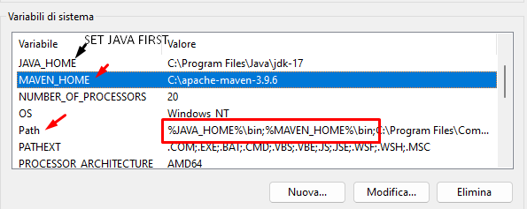
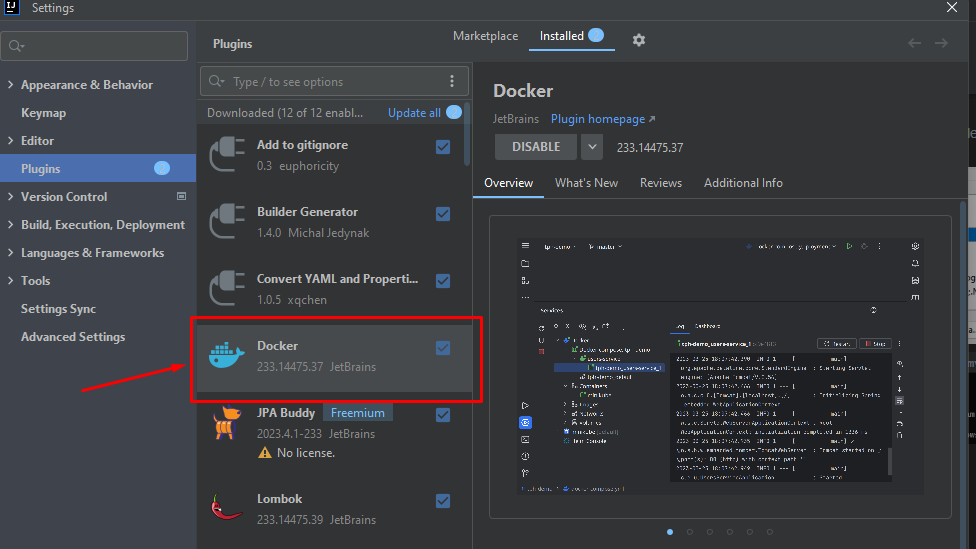
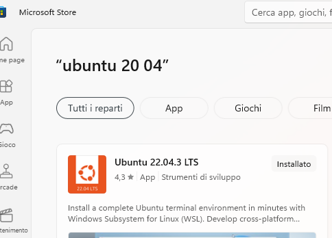

Simple SpringBoot  Docker Image Example
=============
---

[`SPRINGBOOT`]    [`DOCKER`] 

# Required Setup

- [**Spring Boot v.3**](http://projects.spring.io/spring-boot/)   or above
- [**Install Java**](https://docs.aws.amazon.com/corretto/latest/corretto-17-ug/windows-install.html) locally and set environment variable system.
    - [Download JDK 17 ORACLE](https://www.oracle.com/java/technologies/downloads/#java17)
    - [Download JDK 17 AMAZON CORRETTO](https://github.com/corretto/corretto-17/releases) 
- [**Maven 3.9.6**](https://maven.apache.org)
    1. **Installing Maven on Windows**:
        1. The environment variable for JAVA also needs to be set beforehand
        2. [**Download Maven zip**](https://maven.apache.org/download.cgi) **apache-maven-3.9.6-bin.zip** on your Computer locally.
        3. Unzip or Extract folder and put on at C disk level.
        4. Create the MAVEN_HOME system environment variable that points to the **_C:\apache-maven-3.9.6_** folder path.
           
        5. Verify the correct MAVEN installation by command [`mvn -v`] 

- [Install Plugin Docker on IntelliJ IDEA](https://plugins.jetbrains.com/plugin/7724-docker)
    * 

- [Windows (WSL 2) Subsystem for Linux Documentation](https://learn.microsoft.com/en-us/windows/wsl/)
    * 

- [Docker Desktop for Windows](https://docs.docker.com/desktop/install/windows-install/) after download and created account on Docker, it's necessary bind to subsystem WSL Windows.
    * 


### Step by step

1. Create your project with [**Spring Initailizr**](https://start.spring.io/)    and create jar by Maven command [`mvn clean install`].

2. Create your Docker File named [`Dockerfile`] without extension at project level folder

     ```
      FROM openjdk:17-jdk-alpine
      VOLUME /tmp
      ARG JAVA_OPTS
      ENV JAVA_OPTS=$JAVA_OPTS
      COPY target/docker-0.0.1-SNAPSHOT.jar docker.jar
      EXPOSE 8181
      ENTRYPOINT exec java $JAVA_OPTS -jar docker.jar
    ```

    *  [**What is a Dockerfile?**](https://medium.com/containers-101/building-docker-images-with-dockerfiles-361d1d0a4047)
       A Dockerfile is a text configuration file written using a special syntax
       It describes step-by-step instructions of all the commands you need to run to assemble a Docker Image.
       The docker build command processes this file generating a Docker Image in your Local Image Cache, which you can then start-up using the docker run command, or push to a permanent Image Repository.


# CREATE IMAGE BY [**DOCKER COMMAND**](https://docs.docker.com/reference/cli/docker/)
* [**Docker**](https://medium.com/@anshulganvir/introduction-to-docker-337b9d09a079) is an open-source software platform that enables developers to create, deploy, and manage applications in a wide variety of computing environments.

* **Docker Image**: A Docker image is a lightweight, standalone, and executable package that contains everything needed to run an application, including the code, runtime environment, libraries, and system tools.

* The following command creates a Docker image associated with a **specific name and tag**. Run the command at the root level of the folder.

     ```
        docker build -t docker-image:my-tag .
     ```

    -  Command images list
        ``` 
           docker images
        ```

       output:

          ``` 
             PS docker-simple-example\docker> docker images   
             REPOSITORY        TAG             IMAGE ID       CREATED          SIZE
          -> docker-image      my-tag          635c7d0e3032   10 minutes ago   376MB
             myimage-1         mytag-1         9e3b555bbe6b   2 days ago       565MB
             eclipse-temurin   17-jdk-focal    b1b08304f7e3   7 days ago       411MB
             openjdk           17-jdk-alpine   264c9bdce361   2 years ago      326MB
          ``` 

    - After creation image you can exec Container dinamically with random name
      on specific PORT on hostname "localhost". Execute that command at root level project.

       ``` 
          docker run -p 8181:8181 -t docker-image:my-tag
       ```

# CREATE CONTAINER
[Docker Container CLI](https://docs.docker.com/reference/cli/docker/container/)

* [**Docker Container**](https://medium.com/@anshulganvir/introduction-to-docker-337b9d09a079): A container is an isolated environment for your code. This means that a container has no knowledge of your operating system or your files.

* This command create a Container for current Image Docker with specific name and IP with PORT. Execute at root level project.

  ``` 
    docker container create --name your_name_container -p 192.168.1.189:8181:8181 -it docker-image:my-tag
  ```   

    - After creation container execute it with :

      ``` 
       docker start your_name_container
      ```


# RUN CONTAINER

* This command is COMPLETE because it dynamically creates a Container with Name, IP
  and a specific Port for both the APP and the Container, and runs the container with
  the current Docker image [docker-image:my-tag]. Execute at root level project.

  > docker run -p [ip host]:[port app]:[port container] --name your_name_container [image-name]:[tag-name]

    ``` 
        docker run -p 192.168.1.187:8181:8181 --name your_name_container docker-image:my-tag
        
    ``` 

After create and execute Container go to: http://[ip]:[port]/api/ip .

